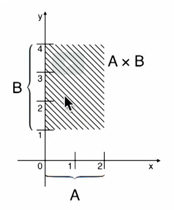

[comment]: <> "LTeX: language=pt-BR"
# Sets

Elementos
- Qualquer coisa

Sets
- Coleção de elementos
- Explícitos {0,1,2,3,4,5}
- Implícitos {0,1,2,....9}
- Descritivos {palavra de quato letras} = {amor, loja, ...}
- Sets comuns, números:  
    - Inteitos = Z = {..., -2, -1, 0, 1, 2, ...}  
    - Naturais = N = {0, 1, 2, ...}  
    - Positivos = P = {1, 2, 3, ...}  
    - Racionais = Q = {fracionais com denominador != 0}  
    - Reais = R = {racionais e irracionais} = todos acima  

Membros
- Membro pertence: $\in$. Ex: 0 $\in \{0,1\}$
- Membro não perntence: $\notin$
- Set contém: $\ni$. EX: $\{0,1\} \ni 0$
- Set não contém $\not\ni$
- A ordem dos membros não importa
- A repetição dos membros não importa

Set Vazio
- Não contém elementos
- $\varnothing$ or $\{\}$
- $\forall x$, $x\notin \varnothing$ ($\forall$ = todos os elementos)

Set Universal
- Todos os elementos possíveis
- $\Omega$
- $\forall x$, $x\in \Omega$
- $\Omega$ depende da aplicação. Por exemplo, quando falamos de temperaturas $\Omega = \mathbb{R}$ (números reais)
- $\Omega = \{palavras\}$

## Sets Básicos

Um set dentro de um universo ou outro set
- $\{X \in A | ...\}$ = {elementos x em A tais quais ...}
- ou $\{x \in A : ...\}$
- Exemplo de números naturais (N): $\mathbb{N} = \{X \in \mathbb{Z} | x>=0 \}$
- Exemplo de números positivos (P): $\mathbb{P} = \{X \in \mathbb{N} | x>0 \}$
- Exemplo de números dado um limite: $\{3,...,5\} = \{i \in \mathbb{Z} | 3 <= i <=5> \} = \{3,4,5\}$

Notação com colchetes e parêntesis
- $[n] = \{1,...,n\}$ -> Set de 1 até n

Intervalos reais
- $[a,b] \{X \in \mathbb{R} | a<= x <= b\}$ = $[3,5] \{3,4,5\}$
- Colchetes = inclui as extremidades
- $(a,b) \{X \in \mathbb{R} | a < x < b\}$ = $[3,5] \{4\}$
- Parêntesis = exclui as extremidades
- $[a,b) \{X \in \mathbb{R} | a <= x < b\}$ = $[3,5] \{3,4\}$
- É possível combinar os dois casos

Divisibilidade
- $m,n \in \mathbb{Z}$ = `n` é múltiplo de `m`, ou `m` é divido por `n` = $m | n$
- Caso `m` não seja divisível por `n` então $m \nmid n$

Set de múltiplos
- $m \in \mathbb{Z}$ = $\,_m\mathbb{Z} = \{i \in \mathbb{Z} : m | i \}$ = Inteiros múltiplos de `m`
- $\,_2\mathbb{Z} = \{\dots,-4,-2,0,2,4,\dots\}$ Números pares
- $m \in \mathbb(Z), n \in \mathbb(P)$ = múltiplos de `m` em {1..n}
- $\,_3[13] = \{i \in \{1,...,13\}:3|i\} = \{3,6,9,12\}$ Múltiplos de 3 de 1 até 13

## Relações

Igualdade
- Sets A e B são iguais $A=B$, se possuem exatamente os mesmos elementos. Ex: $\{0,1\}=\{1,0\}$
- Sets A e B são diferentes $A\neq B$, Ex: $\{0,1\} \neq \{1,2\}$

Interseção
- Sets compartilham pelo menos um elemento, $ x \in A \land x \in B$
- Exemplo: $\{0,1\}\{1,2\}$, interseção em (1)
- Sets não compartilham nenhum elemento, $ x \in A \lor x \in B$
- Exemplo: $\{0,1\}\{2,3\}$, não há interseção
- Set vazio $\emptyset$ não tem interseção com nenhum set
- Um universo não vazio $\Omega$ tem interseção com qualquer set
- Um set tem interseção com si próprio se não-vazio

Subsets
- Se todos os elementos de A estão em B, então A é subset de B, $A \subseteq B$
- Exemplo $\{0\} \subseteq \{0,1\}$
- Equivalentemente, B é superset ou contém A, $B \supseteq A$
- Exemplo $\{0,1\} \supseteq \{0\}$
- Se A contém elementos que não estão em B, $A \nsubseteq B$, ou $B \supseteq A$
- Exemplo: $\{0,1\} \nsubseteq \{1,2\}$
- Subsets entre sets numéricos, $\mathbb{P} \subseteq \mathbb{N} \subseteq \mathbb{Z} \subseteq \mathbb{Q} \subseteq \mathbb{R}$
- Set vazio, $\emptyset \subseteq A \subseteq A \subset \Omega$
- Se $A \subseteq B$ e $B \subseteq C$ então $A \subseteq C$
- Se $A \subseteq B$ e $B \subseteq A$ então $A = B$

Subset estrito
- Se $A \subseteq B$ e $A \neq B$, então A é um subset estrito, $A \subset B$, logo, B é superset de A $B \supset A$
- Exemnplo: $\{0\} \subset \{0,1\}$ ou $\{0,1\} \supset \{0\}$
- Se A não é um subset estrito de B, $A \not\subset B$ ou $B \not\supset A$
    - Se não é subset de B, $A \nsubseteq B$, ex: $\{0\} \nsubseteq \{1\}$
    - Se A igual a B, $A = B$, ex: $\{0\} \not\subset \{0\}$. Mesmo contendo os mesmos elementos A não é considerado subset estrito de B

Pertence ($\in$) X Subset ($\subseteq$)
- $\in$ é a relação entre um elemento e um set, $x \in A$, o elemento `x` pertence ou é contido no set `A`. 
- Exemplos: $0 \in \{0,1\}$ `0` pertence, $\{0\} \notin \{0,1\}$ o set `{0}` não pertence
-  $\subseteq$ é a relação entre dois sets, $A \subseteq B$, `A` é subset de `B`
- Exemplo: $\{0\} \subseteq \{0,1\}$, o set `{0}` pertence, $0 \nsubseteq \{0,1\}$, `0` não é subset
- Exceção do set vazio. $\emptyset \in \{\emptyset\}$ e $\emptyset \subseteq \{\emptyset\}$. Subset vazio é um elemento e subset do set $\{\emptyset\}$

## Operações

Complemento
- Relembrando que o universo $\Omega$ contém todos os elementos
- O `complemento` $A^c$ de $A$ é o set do universo $\Omega$ que não estão em $A$. Ou seja, $A^c = \{ x \in \Omega : x \notin A\}$
- Ex: $\Omega = \{0,1\}$, $\{0\}^c = \{1\}$
- Ex: $\Omega = \{0,1\}$, $\{0,1\}^c = \{\emptyset\}$
- Ex: $\Omega = \{0,1,3\}$, $\{0\}^c = \{1,2\}$

Identidades
- Relações para todos os sets
- $\emptyset^c = \Omega$ e $\Omega = \emptyset^c$
- $A$ e $A^c$ são `disjoint`
- $(A^c)^c = A$
- $A \subseteq B$ então $A^c \supseteq B^c$

Interseção
- A interseção entre $A \cap B$ é o set de elementos em abos A e B. Ex: $\{0,1\} \cap \{1,3\} = \{1\}$
- Exemplo set vazio: $\{0\} \cap \{1\} = \emptyset$

Uniâo
- A união de $A \cup B$ é a coleção de elementos em A, B ou em ambos. Ex: $\{0,1\} \cup \{1,2\} = \{0,1,2\}$

Idetidades ou Leis
- Identidade: $A \cap \Omega = A$ e $A \cup \Omega = \Omega$
- Ligação universal: $A \cap \emptyset = \emptyset$ e $A \cup \emptyset = A$
- Indepotência: $A \cap A = A$ e $A \cup A = A$
- Complemento: $A \cap A^c = \emptyset$ e $A \cup A^c = \Omega$

Diferença
- A difereça de $A - B$ é o set de elementos presentes em A mas não em B. Ex: $\{0,1\} - \{1\} = \{0\}$
- Ex: $\{0,1\} - \{0,1,2\} = \emptyset$
- Pode ser notado com `\`. Ex: $A \backslash B$

Diferença simétrica
- A diferença simétrica de dois sets é o set de elementos em exatos um set. Ex: $\{0,1\} \Delta \{1,2\} = \{0,2\}$
- Ex: $A \Delta B = (A-B) \cup (B-A)$

## Produto cartesiano

Tuplas e pares ordenados
- Em um Set: ordem e repetição não importam $\{a,b,c\} = \{b,c,a\}$
- Em uma Tupla: ordem e repetição importam $\{a,b,c\} \neq \{b,c,a\}$
- Em um par ordenado ou 2-tuple: ordem e repetição importam $(3,7)$
    - Também é utilizado para definir intervalos

Produto cartesiano
- O produto cartesiano de A e B é o set $A \times B$ de pares ordenados $(a,b)$, onde $a \in A$ e $b \in B$.
- $A \times A$ é esctrito $A^2$
- Exemplo: $A=[0,2]$ $B = [1,4]$  
$A \times B = \{(x,y) : X \in [0,2], y \in [1,4]\}$  

Sets discretos
- Sets finitos
- Exemplo:  
$\{a,b\} \times \{1,2,3\}$ = $\{x,y\} : x \in {a,b}, y \in \{1,2,3\}$  
$\{a,b\} \times \{1,2,3\}$ = $\{(a,1),(a,2),(a,3),(b,1),(b,2),(b,3)\}$  
$\begin{matrix}
  (a,1) & (a,2) & (a,3) \\
  (b,1) & (b,3) & (b,3)
 \end{matrix}$

Identidades
- $A \times \emptyset = \emptyset \times A = \emptyset$
- $A \times (B \cup C) = A \times B \cup A \times C$
- $A \times (B \cap C) = A \times B \cap A \times C$
- $A \times (B - C) = A \times B = A \times C$

Tabelas
- São um exemplo de produto cartesiano

Produto cartesiano com 3 sets
- $A \times B$, retânguilo bidimensional
- $A \times B \times C$, "cubo" tridimensional

Sequências
- São tuplas sem `()` ou `,`
- $\begin{matrix}
  (a,1) & (a,2) & (a,3) \\
  (b,1) & (b,3) & (b,3)
 \end{matrix} = 
 \begin{matrix}
  a1 & a2 & a3 \\
  b1 & b3 & b3
 \end{matrix}$
- $\{0,1\}^2 = \{xy : x,y \in \{0,1\}\} = \{00,01,10,11\}$

